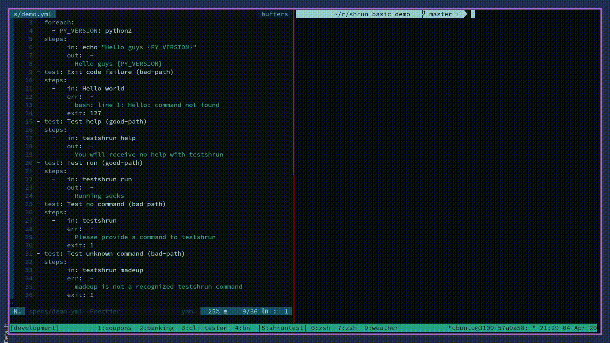

<p align="center">
    
    
    
</p>

# shrun

Test CLI commands in isolated docker containers.



### Dependencies

Docker is required to run `shrun`

[Install Docker here if you need it](https://download.docker.com/)

## Quickstart

**Add shrun to your project**

```bash
npm install --save-dev shrun
# or for yarn
yarn add --dev shrun
```

**Build the default shrun image**

```bash
npx shrun build <your-cli-command>
```

*depending on how Docker is installed, `sudo` may be necessary*

```bash
sudo -E npx shrun build <your-cli-command>
```

> Note: You will need to replace \<your-cli-command> with your own CLI command. The CLI command is the one registered to "bin" in your package.json

**Create a simple spec**

By default, `shrun` looks for "specs" (CLI tests) in the `<project-root>/specs` directory. Here is an example spec that tests the `echo` command in bash:

`specs/demo.yml`
```yml
---
- test: Test echo (good-path)
  steps:
    -   in: echo "Hello world"
        out: |-
          Hello world
```

Replace or add to this spec to test your specific CLI command. As long as you built the default `shrun` image, it should work out of the box.

For detailed information about writing `shrun` specs, read below `<REPLACE ME WITH LINK>`.

**Run the demo.yml spec**

```bash
npx shrun
```

*sudo version*

```bash
sudo -E npx shrun
```

## Why shrun?

`shrun` aims to bring consistency and convenience to the process of testing command line tools. Each individual spec is run in an isolated Docker container, leaving you free to break things without worrying about affecting other tests. The best part is that `shrun` is built on Jest, many of the standard Jest options work out of the box.

### Benefits of shrun

* Enables you to run thousands of parallel tests, each in their own isolated sandbox.
* Makes it possible to test the end-to-end flow of your CLI, including installation and removal.
* Built on top of Jest and accepts many of the Jest CLI options.
* Simple declarative test-spec format makes it a joy to write tests. Tests can even be used to drive the CLI product development process. 


### Examples and resources

A standalone example repo has been created to showcase `shrun`. The repo contains a basic command line tool `testshrun` and a few example specs:

https://github.com/rylandg/shrun-basic-demo


### Known issues and unfinished work

* `shrun` does not currently support a configuration file. This feature is planned and prioritized and the file will support many of the configuration options available to Jest.

* some CLI outputs still refer to Jest instead of `shrun`

* shrun does not support test coverage as this is quite difficult to support. I would love to support this but realistically it might not happen.